# Chapter 4

## スタックとヒープ

正確ではありません  
雰囲気を示します  

スタックへのデーターの置き方  



下から上へ積み上げます  

ヒープへのデーターの置き方  


ヒープへは、平面的に並べていきます    

ヒープにデーターを置くとき、同時にスタックにもデーターが置かれます  
スタックに置かれるデーターは、ヒープに置かれるデーターの場所や大きさなどをもつデーターです  
こちらのドキュメントでは、スタックに置かれるデーターは、データーについてのデーターなので Metadata と呼ぶことにします  

スタックに置く実例を見てみます  

```rust
let mut x = 57;
```



ではヒープに置くにはどうすればいいでしょうか  
Box を使います  

```rust
let mut x = Box::new(57);
```


## mut

Chapter 2 で、可変変数をつくるときは、つぎのようにしました  

```rust
let mut x = 57;
```

こちらは、自由に変更することができました  

```rust
let mut x = 57;
x = 58;
```

じつは mut を削除すると、変更できなくなります  

```rust, compile_fail
let x = 57;
x = 58;
```

```no_compile
error[E0384]: cannot assign twice to immutable variable `x`
 --> src/main.rs:6:5
  |
5 |     let x = 57;
  |         -
  |         |
  |         first assignment to `x`
  |         help: consider making this binding mutable: `mut x`
6 |     x = 58;
  |     ^^^^^^ cannot assign twice to immutable variable

For more information about this error, try `rustc --explain E0384`.
```

mut は mutable の略で 変更できる くらいの意味です  

## 所有権

所有権というより、ごみ当番です  
いまつぎのようなブロックを準備し、中でスタックにデーターを置きます  

```rust, compile_fail
async {
    let x = 57;
}.await;
```


await で中を実行します  
let x = 57 のときに x は 57 というごみの当番になります  
x はごみ当番なので } に到達したときに 57 を破棄します  

ヒープにデーターを置いた場合はどうでしょうか  

```rust, compile_fail
async {
    let x = Box::new(57);
}.await;
```


await で中を実行します  
let x = Box::new(57) のときに x は Metadata というごみの当番になります  
x はごみ当番なので } に到達したときに Metadata を破棄しようとするのですが、Metadata はごみそのものではなく、ごみの情報が書いてあるだけです    
それで x は Metadata の示す、ヒープにあるごみを見つけ出して破棄します  
つまりヒープにある 57 を破棄します  
その後 Metadata も破棄します  

## ムーブ

ムーブとは Metadata を別の変数に渡すことで、ごみ当番が代わることです  
まずヒープにデーターを置きます  

```rust
let x = Box::new(57);
```


つぎのようにすると Metadata を渡すことができます  
このとき 57 は動いていません  

```rust
let x = Box::new(57);
let y = x;
```


いまや x ではなく y がごみ当番です  
そして x は、なんのデーターももっていませんから、使おうとすれば当然エラーです  

```rust, compile_fail
let x = Box::new(57);
let y = x;
dbg!(x);
```

```no_compile
error[E0382]: use of moved value: `x`
 --> src/main.rs:8:14
  |
6 |         let x = Box::new(57);
  |             - move occurs because `x` has type `Box<i32>`, which does not implement the `Copy` trait
7 |         let y = x;
  |                 - value moved here
8 |         dbg!(x);
  |              ^ value used here after move
  |
help: consider cloning the value if the performance cost is acceptable
  |
7 |         let y = x.clone();
  |                  ++++++++

For more information about this error, try `rustc --explain E0382`.
```

こちらが Chapter 2 の for 2 で  
for でベクターを使ったあと、さらにベクターを使うことができなかった理由です  
ベクターはヒープにデーターが置かれます  
そして v のもっていたベクターへの Metadata が for のところでムーブされてしまったので、その後は使えなかったのです  

スタックにデーターを置く場合は、ムーブは起こりません  
単にデーターを Copy するだけです  

```rust
let x = 57;
```


```rust
let x = 57;
let y = x;
```



x のもっている 57 と y のもっている 57 には、なんのつながりもありません  
} に到達したら  
x は自分のもっている 57 を廃棄し  
y は自分のもっている 57 を廃棄します  
x も y も各自のもつごみのごみ当番です  

## Clone と参照

もう一度さきほどの例を考えます  

```rust, compile_fail
let x = Box::new(57);
let y = x;  // Move (x -> y)
dbg!(x);    // Error
```


Move のところで x から y へムーブが起こり x は使えなくなってしまうのでした  
では y から値を見れるようにしつつも x を使えるままにしておくことはできないのでしょうか  

一番かんたんと思える方法は、同じものをもう 1つ 用意することです  
まず元のデーターを置いて

```rust
let x = Box::new(57);
```


Clone して同じものを y のためにも用意します  

```rust
let x = Box::new(57);
let y = x.clone();
```



こちらで注意したいのは、x のもつ Metadata と y のもつ Metadata' (よく見ると ' が付いています) は、完全に同じではないということです  
x のもつ Metadata はヒープの上の方のデーターを指していますが y のもつ Metadata' はヒープの下の方のデーターを指しています  

1つ 前のムーブの節の最後でスタックに置いたデーターを Copy する様子を示しました  

```rust
let x = 57;
let y = x;
```


こちらの場合は、x と y のもつデーターは完全に同じです  
Rust ではこのように単純に同じものをもう 1つ つくることを Copy と言います  
Copy するときには = を使います  

一方で Metadata とそれの指すデーターから、機能的に同じになるように Metadata' とそれの指すデーターをつくることは、そう単純ではないです  
Rust ではこのような複雑な操作で機能的に同じものをつくることを Clone と言います  
Clone するときには .clone() を使います  

さて、x から y へムーブしたあとも x を使えるままにする別の方法はあるでしょうか  
つぎのようにできます  
まず元のデーターを置いて

```rust
let x = Box::new(57);
```



y は x につなげます  

```rust
let x = Box::new(57);
let y = &x;
```



このように & を使うと Metadata-x のようにある変数を指す Metadata を手に入れることができます  
そして変数の前に & を付けたものやそれによって手に入った Metadata を 参照 と呼びます  
たとえば &x は x への参照です  
そしてこちらで重要なのは x と Metadata-57 とヒープの 57 に変化がないことです  
y = &x のあとも x を使いつづけることができます  

ちなみに x は Metadata でなくても大丈夫です  
たとえばつぎのようにです  

```rust
let x = 57;
let y = &x;
```


## 参照外し

参照の情報をたどって元のデーターを手に入れたいときはどうすればいいのでしょうか  
たとえば直前の例で言えば &x (Metadata-x) を使って 57 を手に入れたいときです  
参照外し をすれば達成できます  
つぎのように書きます  

```rust
let x = 57;
let y = &x;
assert!(*y == 57);
```


\* を参照に付けると参照外しができます  
こちらでは y が「x への参照」ですから * を付けて参照を外す、つまり *y で x の値が手に入ります  

\* は 2つ 以上付けることもできます  

```rust
let x = 57;
let y = &x;
let z = &y;
assert!(**z == 57);
```

またこちらの y と

```rust
let x = 57;
let y = &x;
```


こちらの x を比較すると

```rust
let x = Box::new(57);
```


両方とも Metadata をもっていて Metadata の先にデーターがあるという点で似ています  
もちろん似ているだけで Box は参照ではないのですが (& が一度も登場していないのが証拠です)、Box も参照外しで Metadata の先のデーターが取り出せたらいいなと思うのは自然の流れです  
それで Box はその機能を実装しています  

```rust
let x = Box::new(57);
assert!(*x == 57);
```

Box と参照が混ざっていても、ともに * で参照外しできます  

```rust
let x = Box::new(57);
let y = &x;
assert!(**y == 57);
```


## 可変参照

参照には大きな制限があります  
それは参照先のデーターを変更できないということです  

## どちらが変更可能

```rust
let x = 57;
let y = &x;
```

y のデーターは x への参照 から変更できません  
*y は x のデーターを変更できません  

```rust
let mut x = 57;
let y = &x;
```

y のデーターは x への参照 から変更できません  
*y は x のデーターを変更できません  

```rust, compile_fail
let x = 57;
let y = &mut x;  // Compile Error
```

変数 x への可変参照をつくれません  

```rust
let mut x = 57;
let y = &mut x;
```

y のデーターは x への可変参照 から変更できません  
*y は x のデーターを変更できます  

```rust
let x = 57;
let mut y = &x;
```

y のデーターは x への参照 から変更できます  
*y は x のデーターを変更できません  

```rust
let mut x = 57;
let mut y = &x;
```

y のデーターは x への参照 から変更できます  
*y は x のデーターを変更できません  

```rust, compile_fail
let x = 57;
let mut y = &mut x;  // Compile Error
```

変数 x への可変参照をつくれません  

```rust
let mut x = 57;
let mut y = &mut x;
```

y のデーターは x への可変参照 から変更できます  
*y は x のデーターを変更できます  

並行処理 &mut を & へ代入  
