# Chapter 4

## スタックとヒープ

正確ではありません  
雰囲気を示します  

スタックへのデータの置き方  



ヒープへのデータの置き方  



実例を見てみます  

```rust
let mut x = 57;
```



ではヒープに置くにはどうすればいいでしょうか  
Box を使います  

```rust
let mut x = Box::new(57);
```


## mut

Chapter 2 で、変数をつくるときは、つぎのようにしました  

```rust
let mut x = 57;
```

こちらは、自由に変更することができました  

```rust
let mut x = 57;
x = 58;
```

じつは mut を削除すると、変更できなくなります  

```rust, compile_fail
let x = 57;
x = 58;
```

```no_compile
error[E0384]: cannot assign twice to immutable variable `x`
 --> src/main.rs:6:5
  |
5 |     let x = 57;
  |         -
  |         |
  |         first assignment to `x`
  |         help: consider making this binding mutable: `mut x`
6 |     x = 58;
  |     ^^^^^^ cannot assign twice to immutable variable

For more information about this error, try `rustc --explain E0384`.
```

mut は mutable の略で 変更できる くらいの意味です  

## 所有権

所有権というより、ごみ当番です  
いまつぎのようなブロックを準備し、中でスタックにデータを置きます  

```rust, compile_fail
async {
    let x = 57;
}.await;
```


await で中を実行します  
let x = 57 のときに x は 57 というごみの当番になります  
x はごみ当番なので } に到達したときに 57 を破棄します  

ヒープにデータを置いた場合はどうでしょうか  

```rust, compile_fail
async {
    let x = Box::new(57);
}.await;
```


await で中を実行します  
let x = Box::new(57) のときに x は Metadata というごみの当番になります  
x はごみ当番なので } に到達したときに Metadata を破棄しようとするのですが、Metadata はごみそのものではなく、ごみの情報が書いてあるだけです    
それで x は Metadata の示す、ヒープにあるごみを見つけ出して破棄します  
つまりヒープにある 57 を破棄します  
その後 Metadata も破棄します  

## ムーブ

ムーブとは Metadata を別の変数に渡すことで、ごみ当番が代わることです  
まずヒープにデータを置きます  

```rust
let x = Box::new(57);
```


つぎのようにすると Metadata を渡すことができます  
このとき 57 は動いていません  

```rust
let x = Box::new(57);
let y = x;
```



いまや x ではなく y がごみ当番です  
そして x は、なんのデータも持っていませんから、使おうとすれば当然エラーです  

```rust, compile_fail
let x = Box::new(57);
let y = x;
dbg!(x);
```

```no_compile
error[E0382]: use of moved value: `x`
 --> src/main.rs:8:14
  |
6 |         let x = Box::new(57);
  |             - move occurs because `x` has type `Box<i32>`, which does not implement the `Copy` trait
7 |         let y = x;
  |                 - value moved here
8 |         dbg!(x);
  |              ^ value used here after move
  |
help: consider cloning the value if the performance cost is acceptable
  |
7 |         let y = x.clone();
  |                  ++++++++

For more information about this error, try `rustc --explain E0382`.
```

こちらが Chapter 2 の for 2 で  
for でベクターを使ったあと、さらにベクターを使うことができなかった理由です  
ベクターが for のところでムーブされてしまったので、その後は使えなかったのです  

スタックにデータを置く場合は、ムーブは起こりません  
単にデータをコピーするだけです  

```rust
let x = 57;
```


```rust
let x = 57;
let y = x;
```



x の持っている 57 と y の持っている 57 には、なんのつながりもありません  
} に到達したら  
x は自分の持っている 57 を廃棄し  
y は自分の持っている 57 を廃棄します  
x も y も各自の持つごみのごみ当番です  

参照 借用 貸借チェッカー  
